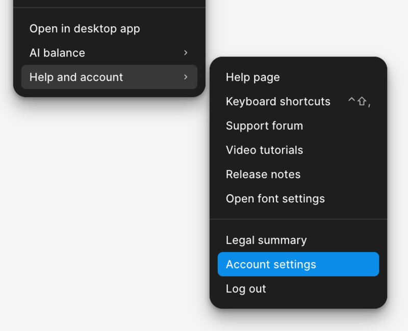
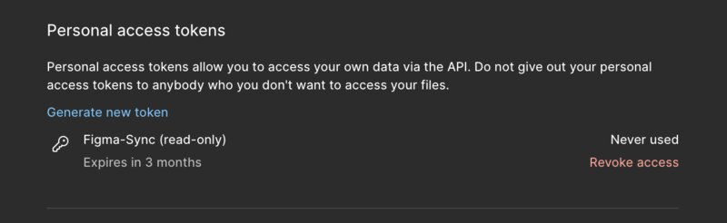
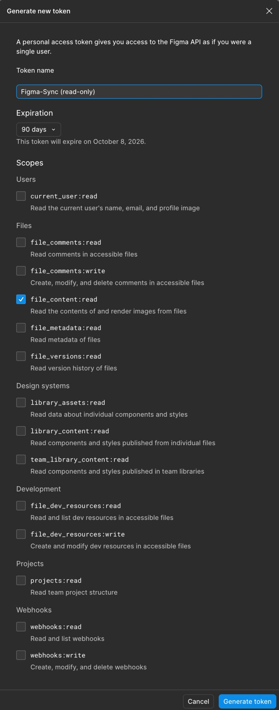

# Figma token setup

The `rest` backend (the default) authenticates with a **Figma personal access
token (PAT)** supplied via the `FIGMA_TOKEN` environment variable — typically in
the consuming project's gitignored `.env` (see the main README).

## Create the token

1. In Figma, open the account menu → **Help and account → Account settings**.

   

2. Go to the **Security** tab → **Personal access tokens** → **Generate new
   token**. After generating, the token is listed here (and can be revoked).

   

3. In the dialog: give it a name (e.g. `Figma-Sync (read-only)`), pick an
   expiration, and select **only the scopes below** (just `file_content:read`).
   Copy the token value once — Figma shows it a single time — into your `.env`
   as `FIGMA_TOKEN=…`.

   

## Scopes

figma-sync is **read-only** and calls exactly one endpoint —
`GET /v1/files/:key/nodes` — so it needs a single scope.

### Required

| Scope | Why |
|-------|-----|
| `file_content:read` | Read node/file content (and render images). The only scope the tool uses. |

### Optional — only for future/opt-in features

| Scope | Enables |
|-------|---------|
| `file_metadata:read` | A cheap "did the file change at all?" pre-check via `GET /v1/files/:key/meta` before rendering each node. |
| `file_versions:read` | Version-history / named-version based change detection. |
| `webhooks:read` + `webhooks:write` | Push-based change notifications via Figma webhooks (write is needed to create the webhook). |

### Not needed — leave unchecked (least privilege)

`current_user:read`, `projects:read`, `file_comments:read`,
`file_comments:write`, `library_assets:read`, `library_content:read`,
`team_library_content:read`, `file_dev_resources:read`,
`file_dev_resources:write`.

**No `*:write` scope is ever required** — the tool never writes to Figma. Grant
just `file_content:read` unless you opt into one of the features above.

## Rotation & expiry

- Tokens can expire (e.g. 90 days). When one expires, `figma:status` falls back
  to the `snapshot` backend and prints a warning; generate a new token and
  update `.env`.
- If a token leaks, revoke it from the same **Security → Personal access
  tokens** list ("Revoke access") and issue a new one.
- Never commit the token. `.env` is gitignored; `.env.example` documents the
  variable without a real value.
